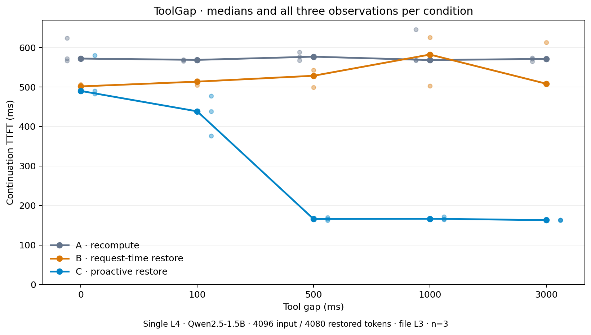
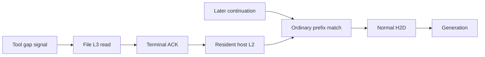

# ToolGap

**Experimental proactive KV prefetch for SGLang tool-using agents.**

Hide KV-cache restore latency inside agent tool calls: restore a known prefix
from file-backed storage into resident CPU L2 before the continuation arrives.
The continuation uses ordinary SGLang prefix matching, H2D and generation.

**67–71% lower median continuation TTFT versus request-time L3 restore at
500–3000 ms tool gaps in our single-L4 benchmark.** Qwen2.5-1.5B-Instruct,
4096 input tokens (4080 restored), file-backed L3, single worker, TP1/PP1,
three repetitions per condition. This is a scoped experiment, not a universal
performance or production-readiness claim.

| Tool gap | Recompute A | Request-time restore B | Proactive restore C | Reduction vs B |
|---:|---:|---:|---:|---:|
| 0 ms | 572 ms | 502 ms | 490 ms | 2% |
| 100 ms | 569 ms | 514 ms | 438 ms | 15% |
| 500 ms | 577 ms | 528 ms | 166 ms | 69% |
| 1000 ms | 568 ms | 582 ms | 166 ms | 71% |
| 3000 ms | 571 ms | 508 ms | 163 ms | 68% |



All 45 trials produced identical 32 output token IDs. B consumed 4080 storage
tokens; C consumed 4080 host tokens. No duplicate backend pages were read and no
relevant host eviction occurred. All nine C trials at gaps ≥500 ms published L2
before continuation submission; no proactive H2D occurred. At zero gap there is
no convincing benefit (one paired C trial was slower). Local files may have warm
OS page cache. n=3 does not establish statistical significance.

## Start

```bash
git clone https://github.com/mks-hash/toolgap.git
cd toolgap
bash scripts/install.sh
# Offline audit; no model download, server, GPU or cloud resources:
bash examples/demo.sh --replay
```

The installer creates a pinned SGLang source checkout and applies two patches.
It deliberately does not install CUDA dependencies into your current Python.
For a real GPU demo on an existing NVIDIA L4 machine:

```bash
docker build -f repro/Dockerfile -t toolgap:v0.1 .
mkdir -p results/local
docker run --rm --gpus all --shm-size=2g \
  -v "$PWD/results/local:/results" toolgap:v0.1 demo
```

The demo seeds file L3, starts fresh empty L1/L2 servers, submits proactive
prefetch before a synthetic 500 ms tool wait ends, and checks the normal model
continuation against A/B baselines. It also checks wasted-prefetch reclamation.
It is a systems demo; it does not invoke a real external tool or agent framework.
The release Dockerfile wraps the validated source/environment; its assembled
image has not been rebuilt or rerun on GPU for this release. See
[reproduction](docs/REPRODUCE.md) for prerequisites and exact commands.

## Control API

`POST /hicache/prefetch` accepts `submit`, `status`, and `cancel`.
Send exact model token IDs, not text or a speculative future prefix. Example
request shape (use a prefix above the configured threshold in a real call):

```json
{"action":"submit","operation_id":"session-1-tool-1","input_ids":[1,2,3,4],"ttl_ms":10000}
```

[API and lifecycle semantics](docs/API.md) explain page alignment, salts,
idempotency, TTL, terminal ACKs and cleanup. Authentication follows SGLang's admin
API. Submit does no generation and no GPU transfer.



## Compatibility and validation

- Exact upstream base: `80bb3fb6511ac421ed3b4309067681392203f3bd`.
- `patches/0001-lifecycle.patch`: prerequisite finite-I/O fix, separately proposed
  in [SGLang #42149](https://github.com/sgl-project/sglang/pull/42149).
- `patches/0002-proactive-prefetch.patch`: runtime, regression tests and benchmark.
- GPU-validated feature: `4a7c68d30913cb084c821ad044ae4ef037933c29`.
  v0.1 adds a six-line backend-change rejection guard plus two CPU tests.
  No inference/restore algorithm change; that guard has CPU validation only.
- 27 current CPU/controller/API tests passed; the measured version had 25 tests
  also pass inside the L4 environment. These are not 25 CUDA kernel tests.
- Stage 2A: 41 passed / six SWA-only skips, real L3→L2→H2D and deterministic
  generation. Stage 2B: 45 successful real-model trials.

[Review and release checks](docs/REVIEW.md), [Stage 2A](docs/STAGE_2A.md),
[Stage 2B](docs/STAGE_2B.md), [raw CSV](results/trials.csv),
[raw JSON/traces](results/raw), and [median CSV](results/medians.csv).
The Stage reports are historical validation records, not current instructions.
No public repository or release depends on upstream merging the patches.

## Limitations

One active restore, one trajectory, fixed model/tokenizer, FULL resident cache,
file backend, TP1/PP1/DP1, Python TreeCore. No SWA, distributed recovery, LoRA,
speculation, multimodal, proactive GPU/HBM load, prediction or general control
framework. Do not change model weights or storage namespace during a process;
restart with an appropriately isolated file store. The API cannot identify an
incorrect model's KV from a caller-provided token prefix. Backend replacement
is rejected by v0.1. API outcomes describe history, not guaranteed residency.

Finite I/O exceptions are recoverable. Permanently blocked backend calls are not.
When continuation never arrives, a successful restore wastes 111.56 MiB in this
benchmark. Completed KV stays ordinarily evictable; cancel does not evict shared
pages. Normal cache flush returned availability to baseline. Use a new operation
ID for a new restore attempt after eviction.

Next product step: a real tool-calling example using this control API.
Apache-2.0; see [LICENSE](LICENSE) and [NOTICE](NOTICE).
