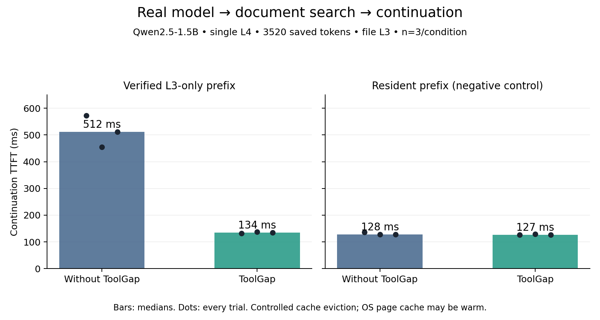
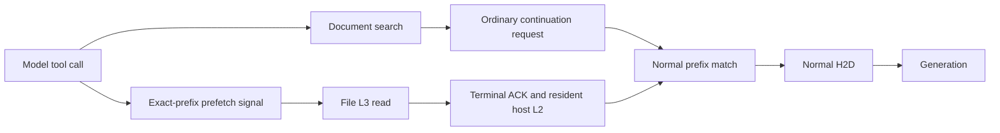

# ToolGap

[](https://doi.org/10.5281/zenodo.23130933)

**Experimental proactive KV prefetch for SGLang tool-using agents.**

Restore reusable KV from file-backed L3 into resident host L2 while a tool works.
The ordinary continuation request then reuses it through normal prefix matching,
H2D and generation.

**73.8% lower median continuation TTFT when reusable KV is L3-only; no meaningful
change when KV is already GPU-resident.**

**34.1% lower end-to-end tool-dispatch-to-first-token latency in the L3-only scenario.**
This interval starts at tool dispatch and excludes the model's earlier tool-selection
turn. **1× NVIDIA L4, Qwen2.5-1.5B-Instruct, file-backed L3, 3520-token reusable
prefix, 3 runs per condition**, single worker, full attention, TP1/PP1.
These are controlled experimental observations, not a universal speedup or
production-readiness claim.

## Technical report

**[Read the eight-page report](docs/report/toolgap-technical-report.pdf)**
by **Maxim Yakimov** (October 4, 2026).
It covers architecture, lifecycle, methodology, both performance datasets,
resident negative control, related work, limitations, and exact reproduction.
[Zenodo report and DOI](https://doi.org/10.5281/zenodo.23130933) ·
[LaTeX / Markdown / evidence audit](docs/report/) ·
[Report release](https://github.com/mks-hash/toolgap/releases/tag/report-v1.0.0).

## v0.2: real model → tool → continuation

The model emits a real `search_documents` call. A subprocess searches a fixed
10,000-record synthetic document archive; the model then consumes that actual
tool result and returns the correct document ID. No artificial `sleep` is used.

| Verified initial prefix state | Baseline median TTFT | ToolGap median TTFT | Baseline tool → first token | ToolGap tool → first token |
|---|---:|---:|---:|---:|
| L3-only | 512 ms | 134 ms | 1159 ms | 764 ms |
| Resident GPU | 128 ms | 127 ms | 748 ms | 759 ms |



Before tool dispatch, both L3-only treatments had **GPU hit=0, host hit=0,
3520 storage tokens available**, with identical L3 payloads. All three proactive
restores published L2 before both tool completion and continuation submission.
The continuation consumed 3520 host tokens, versus 3520 storage tokens in the
baseline. Resident controls issued zero L3 reads. All 12 runs produced identical
output token IDs; duplicate reads=0, proactive H2D=0, cleanup returned host slots
and in-flight operations to baseline. **52/52 regressions and 12/12 real GPU runs
passed**, without skips. The regressions include CPU fixtures run in the GPU image;
they are not 52 CUDA-specific tests.

Cache eviction is controlled explicitly, preserving L3; tool calls do not themselves
cause eviction in this demo. File payload verification and the initial turn can warm
OS page cache. n=3 does not establish statistical significance. The resident result
shows no useful benefit, including a slightly slower median full step with ToolGap.

**When ToolGap helps:** the reusable prefix is in slower storage and tool execution
provides enough time to restore it.

**When ToolGap does not help:** KV is already GPU-resident, or the tool finishes too
quickly to hide meaningful restore work.

[Validation and provenance](docs/TOOL_LOOP_VALIDATION.md) ·
[Raw CSV](results/tool-loop/tool-loop-trials.csv) ·
[Full trials and timestamps](results/tool-loop/tool-loop-trials.json) ·
[Trace](results/tool-loop/tool-loop-trace.jsonl) ·
[Machine-readable verdict](results/tool-loop/VERDICT.json)

## Start

```bash
git clone https://github.com/mks-hash/toolgap.git
cd toolgap
git checkout v0.3.0
bash scripts/install.sh
# In the compatible SGLang/CUDA Python environment:
python -m pip install -e .
```

The installer creates a pinned SGLang checkout and applies the lifecycle and
prefetch patches. It prepares source; install the locked GPU dependencies and
pinned model as described in [reproduction](docs/REPRODUCE.md).

**One-command real tool-loop demo on an existing compatible GPU:**

```bash
MODEL_PATH=/absolute/path/to/Qwen2.5-1.5B-Instruct \
SGLANG_CHECKOUT="$PWD/vendor/sglang" bash examples/tool_loop.sh
```

The runner verifies source/tokenizer hashes, starts servers sequentially, executes
all four conditions with three repetitions, and writes JSON/CSV/trace results
under `work/`. It does not provision cloud resources. See
[exact tool-loop instructions](docs/TOOL_LOOP.md) for model identity, cache controls,
output validation, and cancellation/fallback policy.

A Docker recipe for the same pinned dependencies is also provided:

```bash
docker build -f repro/Dockerfile -t toolgap:v0.3.0 .
mkdir -p results/local
docker run --rm --gpus all --shm-size=2g \
  -v "$PWD/results/local:/results" toolgap:v0.3.0 tool-loop
```

The Docker recipe was not newly built or GPU-executed for v0.3.0.
The recorded demo used the validated immutable CUDA image with the exact source
and ToolGap overlay; [validation](docs/TOOL_LOOP_VALIDATION.md) records its digest.

**Offline audit of both recorded datasets** (no GPU or model download):

```bash
python scripts/check_evidence.py
python scripts/check_tool_loop_evidence.py
```

## v0.3: bounded multi-caller admission and CLI

A process-local coordinator shares one proactive restore slot across callers,
with immediate fallback, owned cancellation, and explicit unknown-usage accounting.
It retains the v0.2 runtime contract. A [two-caller real-GPU smoke](docs/MULTI_SESSION_GPU_SMOKE.md)
passed: 80 regressions, five correct continuations, zero duplicate prefix reads
and cleanup to baseline. One admitted caller benefited; pair-level latency did
not improve in this single-repeat run. See [policy and API](docs/MULTI_SESSION.md)
and the [demo plan and command](docs/MULTI_SESSION_DEMO.md).

Post-v0.3.0 development adds [opt-in bounded status reconciliation](docs/RECONCILIATION.md)
for later callers: local admission is released after confirmed terminal cleanup
while the earlier owner's tool/continuation may still run. Defaults remain manual;
this increment has CPU validation and no new GPU performance claim.
Optional [caller-hint admission](docs/ADMISSION_DESIGN.md) skips known-resident
prefixes or small estimated overlaps before HTTP and records local decisions
and slot timing. Estimates stay separate from restore/usage evidence.

The next [research milestone](docs/RESEARCH_PLAN.md) evaluates multiple model
families and useful agent workloads under cache pressure. It is a plan, not new
measured model support or a cross-family performance claim.
The [local preparation](docs/CROSS_FAMILY_PREPARATION.md) adds native-tokenizer
checks for Qwen/Mistral and a useful multi-round repository investigation runner.
The [passive pressure harness](docs/PASSIVE_PRESSURE_PREPARATION.md) adds direct
cache-state observation and twelve competing repository-audit trajectories with
fixed arrivals, real CPU tools and all-caller accounting. It is locally CPU checked;
actual cross-family generation, natural L3 opportunity rate and workload benefit
remain unmeasured.

## CLI and diagnostics

Available in experimental `v0.3.0`. Install from the tagged checkout with
`python -m pip install -e .`.
[Release notes](docs/RELEASE_v0.3.0.md) describe the scope and validation.

```bash
toolgap doctor --sglang /path/to/patched/sglang --model /path/to/pinned/model
toolgap submit --prefix prefix.json --url http://127.0.0.1:30000 --json
toolgap status OPERATION_ID --json
toolgap cancel OPERATION_ID --json
```

Supply actual saved token IDs and the original salt in `prefix.json`. Doctor
checks only the selected local files/GPU inventory or remote metadata; it does
not submit prefetch, generate tokens or prove cache residency. Control commands
send one RPC, preserve the operation ID on uncertain outcomes, and distinguish
logical cancellation from pending physical cleanup.

[Installation, input format, authentication and exit codes](docs/CLI.md) ·
[Local CLI verification](docs/CLI_VALIDATION.md)

## Thin Python client and control API

```python
from toolgap import PrefetchClient

async with PrefetchClient(url, headers=admin_headers) as client:
    state = await client.submit(operation_id, exact_token_ids,
                                cache_salt=salt, ttl_ms=10000)
    state = await client.status(operation_id)
    state = await client.cancel(operation_id)
```

`POST /hicache/prefetch` accepts `submit`, `status`, and `cancel`. Supply the actual
saved model token IDs and salt namespace, not decoded/re-encoded history or a
predicted prefix. The client creates no session abstraction and performs no GPU
transfer. A successful tool must not cancel a still-useful in-flight restore;
early continuation can join it. Tool failure/cancel attempts bounded cancellation
of its owned operation; admission rejection falls back to ordinary generation.
Transport errors can leave acceptance/cleanup uncertain; server TTL is a backstop.

[API/lifecycle contract](docs/API.md) · [Integration policy](docs/TOOL_LOOP.md)



## Earlier v0.1 systems benchmark

The original **45-trial A/B/C benchmark** used synthetic tool gaps, 4096 input
tokens (4080 restored), 32 output tokens, and three repetitions per condition.
It observed 67–71% lower median continuation TTFT at 500–3000 ms gaps. These
numbers belong to that measured version and workload, not the v0.2 tool-loop demo.

| Tool gap | Recompute A | Request-time restore B | Proactive restore C | Reduction vs B |
|---:|---:|---:|---:|---:|
| 0 ms | 572 ms | 502 ms | 490 ms | 2% |
| 100 ms | 569 ms | 514 ms | 438 ms | 15% |
| 500 ms | 577 ms | 528 ms | 166 ms | 69% |
| 1000 ms | 568 ms | 582 ms | 166 ms | 71% |
| 3000 ms | 571 ms | 508 ms | 163 ms | 68% |

All 45 outputs matched, with no duplicate backend reads or relevant host eviction.
At zero gap there was no convincing benefit. Files may have warm OS page cache.
[Historical Stage 2B report](docs/STAGE_2B.md) · [Raw CSV](results/trials.csv) ·
[Chart](results/ttft.png) · [Raw JSON/traces](results/raw)

## Compatibility and validation

- Exact upstream base: `80bb3fb6511ac421ed3b4309067681392203f3bd`.
- `patches/0001-lifecycle.patch`: prerequisite finite-I/O fix, separately proposed
  in [SGLang #42149](https://github.com/sgl-project/sglang/pull/42149).
- `patches/0002-proactive-prefetch.patch`: runtime, regression tests and benchmark.
- v0.2 demo runtime: `3e60ad803c6b01832b527f4a1dcbeb7a5449964b`, which includes
  the release backend-replacement guard. v0.2 adds the client/integration/demo;
  it introduces no new SGLang runtime patch.
- Model revision: `989aa7980e4cf806f80c7fef2b1adb7bc71aa306`.
- Stage 2A: 41 passed / six SWA-only skips, real L3→L2→H2D and generation.
- v0.1 measured feature: `4a7c68d30913cb084c821ad044ae4ef037933c29`.
- The separate [feature PR #42434](https://github.com/sgl-project/sglang/pull/42434)
  targets a later upstream main. Its [29-test GPU smoke](docs/UPSTREAM_SMOKE.md)
  establishes compatibility; it does not replace either performance dataset.

[Historical release review](docs/REVIEW.md) · [Stage 2A](docs/STAGE_2A.md) ·
[Reproduction](docs/REPRODUCE.md)
The standalone project does not depend on upstream merging either PR.

## Limitations

One active proactive restore per worker. v0.3 adds process-local admission across
callers; the live smoke covers only two trajectories, one repetition. The v0.2
performance evaluation remains single-trajectory. Fixed model/tokenizer, FULL resident cache,
file backend, TP1/PP1/DP1, Python TreeCore. No SWA, distributed recovery, LoRA,
speculation, multimodal, proactive GPU/HBM load, prediction or general framework.
Do not change model weights or storage namespace during a process; restart with
an isolated file store. The API cannot recognize a wrong model's KV from token IDs.
Source/tokenizer guards do not hash every model-weight file. API outcomes describe
history, not guaranteed continued residency.

Finite I/O exceptions are recoverable; permanently blocked calls are unsupported.
When continuation never arrives, a completed restore occupies ordinarily evictable
L2; cancel does not evict shared pages. The v0.1 waste fixture restored 111.56 MiB
and normal flush reclaimed it. The v0.2 L3-only runs restored 96.25 MiB each and
normal flush returned all host slots to baseline. Use a new operation ID for a
new restore attempt after eviction.

Apache-2.0; see [LICENSE](LICENSE) and [NOTICE](NOTICE).
