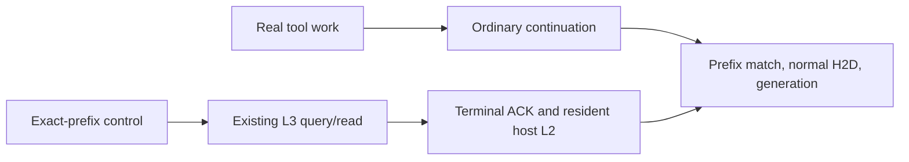

# ToolGap: Hiding KV-Cache Restore Latency During LLM Agent Tool Execution

**Maxim Yakimov** · October 4, 2026 · Technical report, revision 2

Readable companion to `toolgap-report.tex`. The author-exported eight-page Overleaf PDF was visually reviewed; the current source also compiled successfully in the built-in editor on October 4, 2026. Verification provenance is recorded in `pdf-validation.json`. This copy uses the repository's existing recorded charts.

## Abstract

Tool-using language-model applications contain intervals in which an external tool runs before the next generation request can be submitted. If a reusable key–value (KV) prefix has moved below resident GPU and host cache, restoring it only after that request arrives exposes storage latency on the continuation path. ToolGap is an experimental SGLang extension that accepts an exact-prefix control signal during tool execution, restores file-backed KV into resident host L2, and lets the later ordinary request reuse it through existing prefix matching and host-to-device transfer. It adds no proactive GPU transfer and reuses the existing cache controller's allocation, publication, and cleanup machinery.

Two controlled evaluations use one NVIDIA L4 and Qwen2.5-1.5B-Instruct. A 45-trial synthetic-gap experiment observes 67–71% lower median continuation time to first token (TTFT) at 500–3000 ms gaps. A separate 12-run model–document-search–continuation experiment observes median TTFT of 511.96 ms versus 134.30 ms when the reusable prefix is L3-only, and tool-dispatch-to-first-token latency of 1158.86 ms versus 763.89 ms. The GPU-resident negative control shows no meaningful TTFT improvement. Each condition has three repetitions. Cache-state probes, publication timestamps, consumed-cache counters, output-token equality, and cleanup accounting support the intended overlap mechanism. These observations establish a bounded capability, not statistical significance, production readiness, or a universal agent speedup.

## Problem and contribution

A KV cache avoids repeating transformer prefill for a compatible input prefix. SGLang provides radix-based prefix reuse [sglang](https://arxiv.org/abs/2312.07104v2); HiCache extends residency across GPU, host memory, and storage [hicache](https://docs.sglang.io/docs/advanced_features/hicache_design). A prefix can therefore remain reusable even when it is absent from the fast tiers. Availability in storage, however, does not make that prefix immediately executable: lookup, allocation, reads, host publication, and eventual host-to-device (H2D) transfer still take time.

A tool boundary supplies advance knowledge of a saved prefix and time before continuation. ToolGap exposes that knowledge to the runtime without issuing a synthetic generation request. The report answers a narrower systems question: can an external tool-boundary signal make a saved exact prefix available in resident host cache before the next request, while preserving the existing allocation and inference paths? Its contributions are (1) an exact-prefix submit/status/cancel implementation with requestless L2 publication; (2) explicit finite-I/O, cancellation, and terminal-ACK ownership semantics; and (3) reproducible cache-state and timestamp evidence connecting advance restoration to continuation reuse, with a resident negative control.

**Scope.** One worker, one trajectory, fixed text model/tokenizer, full-attention resident cache, file-backed L3, TP1/PP1/DP1, and Python TreeCore. No distributed policy, future-prefix prediction, proactive HBM loading, compression, or general agent framework is introduced. The work does not claim to originate KV prefetching or workflow-aware cache management.

## Architecture and exact-prefix contract

### A control path over the existing data path

The orchestrator sends a control message while a tool runs.

The scheduler creates a unique `CacheRequestHandle`, matches the requested prefix, and submits only its missing span through the existing L3-prefetch machinery. Storage workers query and read into controller-owned host slots. Scheduler-side terminal-event draining publishes valid loaded pages through the existing host-cache insertion path. This progress also runs when there is no active generation batch.

Published KV is ordinary, evictable resident host cache. A later continuation supplies its usual input token sequence and cache salt. Normal prefix matching finds the restored span; the existing H2D path makes it available to inference. ToolGap does not reserve GPU KV, invoke model forward, alter sampling, or introduce a second cache-ownership system.



**Figure 1.** Tool work and storage restoration proceed concurrently. Only the ordinary continuation initiates H2D and generation.

### Minimal API and identity

`POST /hicache/prefetch` accepts `submit`, `status`, and `cancel`. A submission contains `operation_id`, exact `input_ids`, optional `cache_salt`, and `ttl_ms`. Status reports state, restored tokens/bytes, elapsed time, host availability, in-flight accounting, and `cleanup_pending`. The route follows the existing admin authentication policy; it is not intended as a public unauthenticated service.

The token sequence must be the actual saved sequence for the same model, tokenizer, and salt namespace. Decoding historical tokens and encoding the resulting text again can change cache identity. In the tool-loop example only newly appended tool-result text is encoded; historical IDs are preserved. Full-page normalization applies before admission. The benchmark uses 16-token pages and a 64-token prefetch threshold. The application must use an isolated storage namespace for the pinned weights: token IDs alone cannot prove model compatibility.

The manager admits one active restore and retains 32 recent outcomes. An identical retained operation ID and normalized payload returns the existing record; a changed payload is rejected. After a record is forgotten, its ID may be reused, so callers should issue unique IDs. A historical success describes completed work, not guaranteed present-day cache residency. A new restore after eviction requires a new ID.

### Early continuation and the overlap budget

An early, matching continuation may join the in-flight restore. Matching compares its immutable original prefix and salt; an unrelated or replacement request does not inherit the join. Once restoration ends, normal inference proceeds. The conceptual saving is approximately $\min(G,R)$, where $G$ is usable lead time and $R$ is the exposed full L3-to-L2 restore path, provided residency persists and resource contention is small. This is a timing model, not a fitted law: lookup, queueing, read time, H2D, control overhead, and workload variation affect the measured result.

## Lifecycle, cancellation, and correctness

### Finite-I/O prerequisite

Before adding requestless control, finite storage exceptions were found to terminate HiCache workers without a terminal acknowledgement (ACK), stranding registered or allocated prefetch state. Duplicate terminal ACK handling could repeat tail reclamation. A separate prerequisite patch catches eligible query/read exceptions in the resident KV-only path, records a terminal failure, keeps the worker alive, and consumes a terminal ACK once. It remains separate from the proactive feature.

For a started controller operation, the relevant terminal outcomes are success, miss, failure, and cancellation. The control interface additionally reports expiry, already-cached prefixes, and admission decline. These API outcomes must not be confused with physical reclamation completion. A cancelled operation may still own an allocated tail while its backend read runs.

### Ownership across logical cancellation

The safe sequence is submit, allocation, I/O, terminal notification, scheduler drain, publication or host-tail cleanup, and operation removal. Logical cancellation revokes usefulness without freeing memory that an active read may still access. If allocation already occurred, admission of replacement proactive work remains blocked until terminal cleanup relinquishes that tail. A late result remains tied to its unique handle, independently of a user-supplied operation ID, and cannot publish into a replacement operation.

Cancellation before allocation can leave a query finishing later; that query must neither allocate nor publish for cancelled work. Finite reads that eventually return or raise allow the terminal ACK to finish cleanup. A permanently blocked backend call does not. ToolGap makes no timeout-based reclamation guarantee for such a call: freeing its write destination while the worker may access it would violate ownership.

TTL is bounded to 1–60000 ms and limits in-flight usefulness; it is not a lease on resident cache. Cancellation after publication leaves shared KV in ordinary L2. Normal eviction or cache flush reclaims it. Abandoning a completed restore can therefore waste read traffic and capacity without leaking operation-owned slots.

| Boundary | Required behavior in the scoped implementation |
| — | — |
| Query/read exception | Terminal failure; worker remains available for subsequent work. |
| Cancel before allocation | Late query cannot allocate for or revive the cancelled handle. |
| Cancel during allocated read | Logical cancellation first; physical tail cleanup follows terminal drain. |
| Late success / duplicate ACK | No replacement publication; terminal tail consumed at most once. |
| Tool succeeds early | Preserve a useful restore; continuation may join it. |
| Tool fails / caller cancels | Attempt bounded cancellation of the caller-owned operation. |
| Admission / transport error | Ordinary generation can proceed; transport uncertainty is reported. |

### What the tests establish

The inherited finite-I/O suite covers disappearing files, short/corrupt reads, arbitrary read exceptions, pre/post-allocation cancellation, cancellation during reads, late successful completion, and duplicate/late terminal events. Fixtures check host-slot conservation, no double free or stale ongoing-prefetch entries, lock/reference and occupancy baselines, and subsequent usable prefetch/inference paths. Proactive regressions add expiry, duplicate IDs, namespace matching, early continuation, replacement, and bounded state. These tests exercise actual cache/controller/file fixtures where applicable; they are not a proof for all backends or distributed configurations.

The v0.2 image ran 52 regressions with no failures or skips, including CPU fixtures. Its 12 real GPU tool runs tested successful generation and cleanup, not injected backend failures on GPU. Normal post-measurement flush restored 139520 available host slots, zero in-flight accounting, zero ongoing prefetch, and no matching GPU/host prefix in all 12 runs.

## Experimental methodology and provenance

### Common environment and fair comparisons

Both performance experiments used one NVIDIA L4 (24 GB), an 8-vCPU/32-GiB host, Ubuntu 24.04, NVIDIA driver 580.178.04, CUDA 13.0, and PyTorch 2.13.0+cu130. The model is Qwen2.5-1.5B-Instruct at the immutable revision listed below. Full-attention resident HiCache used a 4-GiB host pool and local file storage. Generation was deterministic, with temperature zero and seed 42; model/server/generation settings were matched within each experiment. BF16, Triton attention, PyTorch sampling, and disabled CUDA graphs were used. No artificial storage-I/O delay was injected. Both treatments use the same `wait_complete` storage-prefetch policy, `kernel` H2D backend, `page_first` layout, and `write_through` storage policy, with one running request and an 8192-token context/total-token budget. Other policies, including best-effort restore or choosing recomputation, were not evaluated.

Client TTFT is measured from continuation submission to the first nonempty SSE output-token event. The original experiment used a 4096-token input, a 4080-token reusable span, and 32 output tokens. The real tool loop used a 3511-token prompt plus 23 actual generated tool-call tokens, a page-aligned 3520-token saved span, and 13 continuation output tokens. These workloads and software checkpoints are distinct.

### Three separate bodies of evidence

| Evidence | Design | Purpose |
| — | — | — |
| v0.1 performance | A/B/C $\times$ five gaps $\times$ three repetitions: 45 trials | Synthetic-gap capability and overlap scaling; 4080 reusable tokens. |
| v0.2 performance | Two residency states $\times$ two treatments $\times$ three repetitions: 12 runs | Real tool integration and negative control; 3520 reusable tokens. |
| Fresh-main smoke | 29 tests; one A/B/C run at 500 ms | Compatibility and correctness of the rebased implementation; not a replacement performance dataset. |

**Pinned identities.** The standalone upstream base is `80bb3fb6511ac421ed3b4309067681392203f3bd`; lifecycle prerequisite `37d07d69b62181ca8713b31441218b0591da36de`. The v0.1 measured feature is `4a7c68d30913cb084c821ad044ae4ef037933c29`. The release runtime, including a backend-replacement guard, is `3e60ad803c6b01832b527f4a1dcbeb7a5449964b`; the v0.2 demo measured this runtime with ToolGap integration `0acfc10c6f0ec807e6588384da7fb59d8f383720`. The published ToolGap v0.2.0 snapshot is `74a541e785650537766567b48d2f38cee17199b8`.

The model revision is `989aa7980e4cf806f80c7fef2b1adb7bc71aa306`. The validated CUDA image digest is `sha256:4ae0bb2222247e51d146ff0cb9807240d5abbfe7d1b5d7eb1c9db0b072da07ec`. Exact server commands, raw results, traces, and source/model guards accompany the repository evidence.

### Timing and instrumentation

In v0.2, Linux monotonic timestamps on one machine record $t_0$ (tool dispatch), $t_1$ (prefetch send), $t_2$ (L2 publication), $t_3$ (tool completion), $t_4$ (continuation submission), and $t_5$ (first token). Thus $\mathrm{TTFT}=t_5-t_4$ and $\mathrm{step}=t_5-t_0$. The latter *excludes the earlier model turn that selected the tool*. It is not complete task latency.

For proactive L3 runs, $H_{\mathrm{path}}=\max(0,\min(t_2,t_4)-t_1)$ measures the elapsed pre-arrival path, including control/queue time. Separately instrumented I/O start/end measure actual backend I/O hidden before arrival. Neither quantity alone estimates causal TTFT savings. The residency probe runs on the scheduler thread and performs prefix matching and storage existence checks, not payload reads or allocations.

## Synthetic tool-gap results: v0.1

Mode A starts with an empty L3 and recomputes. Mode B has the known prefix in L3 and uses ordinary request-time restoration. Mode C starts restoring that same known prefix before continuation. GPU and resident host prefixes are absent initially. The five nominal tool gaps are 0, 100, 500, 1000, and 3000 ms. Each A/B/C condition has three repetitions; the final matrix contains exactly 45 distinct trials.

| Gap (ms) | A TTFT | B TTFT | C TTFT | B$-$C (ms) | Reduction |
| — | — | — | — | — | — |
| 0 | 572.02 | 501.54 | 490.00 | 11.54 | 2.30% |
| 100 | 568.70 | 513.58 | 438.40 | 75.19 | 14.64% |
| 500 | 576.80 | 528.49 | 165.71 | 362.78 | 68.64% |
| 1000 | 568.23 | 582.19 | 166.49 | 415.70 | 71.40% |
| 3000 | 571.27 | 508.38 | 162.90 | 345.47 | 67.96% |

**Table 1.** Median client TTFT in milliseconds; $n=3$ per cell. Reductions are calculated from the condition medians, not medians of paired percentage reductions.


**Figure 2.** Recorded synthetic-gap chart. The standalone LaTeX source plots the same five condition medians with explicitly categorical spacing; the repository retains all individual observations.
At 500 ms and above, all nine proactive trials published L2 before continuation. Every B trial consumed 4080 storage tokens; every C trial consumed 4080 host tokens. Each read 255 unique pages and 116981760 bytes (111.56 MiB), with zero duplicate measured page reads and relevant host evictions. All 45 output sequences matched the producer's 32 deterministic IDs. No proactive H2D was observed.

The saving at long gaps is close to the exposed *full* B restore path (344–418 ms), which includes lookup/hashing, allocation, read, and ACK/publication. Hidden C file I/O was about 200–202 ms. At 100 ms, file-I/O overlap was zero even though earlier query/allocation work overlapped. A strict read-only interpretation would therefore miss a real part of the mechanism. At zero nominal gap, control RPC time supplied about 7.9 ms lead; the small median difference is not convincing evidence of useful zero-gap acceleration. Short-gap observations varied substantially. B was not consistently faster than recomputation A: the small-model, local-file workload does not establish that restoring is always preferable to recomputing. The claimed comparison concerns moving B's restore off the continuation path, not an optimal universal restore/recompute policy.

**Run history.** Prototype results were excluded. Final data were collected in two portions (22 and 23 trials), with identical production-file hashes; an overstrict short-gap harness assertion was corrected between portions. Failed/incomplete rows were excluded, retained valid rows were preserved, and producer output equality was rechecked. The final provenance records retain this history. These medians demonstrate timing behavior; three repetitions do not support significance or tail-latency claims.

## Real tool-loop results: v0.2

The model emits `search_documents(query="KV prefetch tool latency")`. A subprocess performs deterministic retrieval over 10000 synthetic document records and returns `DOC-00173`; continuation consumes that actual result and emits the correct document ID. The tool performs real computation without sleep or delay padding. Each invocation parses/tokenizes the full corpus, recomputes document-frequency statistics, scores documents, and sorts candidates. This exhaustive lexical search is not an optimized persistent search index. The long prompt is constructed with 100 repetitions of a notebook-context paragraph, not a naturally collected conversation; corpus size and prompt construction were fixed before measurement. The archive is a controlled fixture, not production retrieval data.

A model-generated reference L3 snapshot is copied and payload-hash-verified for every condition. The same actual tool-call IDs, exact saved prefix, salt, tool, model, tool result, and continuation settings are used. Fresh server processes run in a seeded shuffled order. L3-only runs explicitly flush memory cache while preserving L3; pre-tool probes verify device hit $=0$, host hit $=0$, storage availability $=3520$. Resident runs preserve the prefix and actually find 3520 GPU tokens and zero host tokens. The demo does not claim that a tool call itself evicts KV.

| Initial state | Baseline TTFT | Proactive TTFT | Baseline step | Proactive step |
| — | — | — | — | — |
| L3-only | 511.96 | 134.30 | 1158.86 | 763.89 |
| GPU-resident | 128.16 | 126.98 | 748.39 | 759.11 |

**Table 2.** Medians in milliseconds, $n=3$ per condition. Step is tool dispatch to first continuation token, excluding the initial tool-selection generation.


**Figure 3.** All 12 real-tool observations; horizontal bars are condition medians. Horizontal jitter only separates points.
L3-only median TTFT fell 73.77%; the measured step fell 34.08%. Individual L3 TTFTs ranged from 455.50–573.10 ms for baseline and 132.55–137.20 ms for proactive; these are observed ranges, not confidence intervals. All three proactive L3 publications preceded both tool completion and continuation. Proactive I/O was entirely hidden (291.35–390.55 ms, median 296.80 ms). Client-send-to-publication median was 317.16 ms; submit RPC median was 9.40 ms and ran concurrently with tool work. For repetition 1, events relative to dispatch were: send 1.31 ms, publication 318.47 ms, tool complete 630.39 ms, continuation 631.17 ms, first token 763.72 ms. These are one trace's events, not independently aggregated medians.

Both L3 treatments read exactly 220 pages / 100925440 bytes (96.25 MiB). Baseline continuation consumed 3520 storage tokens; proactive continuation consumed 3520 host and zero storage tokens. Resident controls issued zero measured L3 payload reads. All 12 runs had identical 13 output IDs, no duplicate page reads, no proactive H2D, and no relevant host eviction. Normal flush returned cleanup/accounting to baseline.

Resident TTFT differed by only 1.18 ms, while its proactive median step was 10.71 ms slower. This is the expected applicability boundary. Backend I/O also varied between L3 treatments (355.97 ms baseline median versus 296.80 ms proactive); the measured TTFT difference cannot be assigned exclusively to overlap. Verified pre-arrival publication and cache consumption demonstrate the mechanism without identifying its precise causal effect from 12 observations.

## Limits, compatibility, and related work

### Threats to validity and operational boundaries

The evaluations have three observations per condition, one small model, one GPU type, one worker, local file storage, and controlled prefix lengths. They do not estimate production p95 latency, throughput under load, concurrent-session contention, or remote-network behavior. File copying, payload verification, and initial generation can warm OS page cache. “L3-only” means absent from SGLang GPU/host cache; it does not mean cold OS page cache or a forced physical-disk read. Instrumentation, CPU contention, and read variability can affect timing. The deterministic retrieval corpus and chosen successful query do not represent the distribution of production tool durations or failures. Initial model turns, server startup, snapshot preparation/verification, and controlled cache flushing occur outside the measured tool-dispatch interval. The experiment does not measure how often real agents become L3-only under memory pressure, or account for a production eviction policy's costs; the speedup is conditional on that verified starting state.

The application supplies exact identity and decides whether continuation is likely. If a tool finishes early, residual restore work can remain exposed. If continuation never arrives, proactive restoration wastes bandwidth and resident capacity. The v0.1 waste fixture loaded 4080 tokens / 111.56 MiB; cancellation after success left ordinary cache, and normal flush reclaimed it. TTL neither pins nor evicts published pages. There is no multi-session admission policy, auto-prediction, model hot-swap support, SWA, distributed recovery, or guarantee for permanently blocked I/O.

**Fresh-main compatibility.** A separate rebase onto upstream `4ab720e6557b44d07bde471ed52a178795298f1a`, feature `d1140b5ec5c320a440fc35b0704f78dbdff31449`, passed 29 tests with zero skips/failures and real storage–host–H2D–generation. Its single 500 ms A/B/C sanity run consumed 4080 storage tokens in B and 4080 host tokens in C, matched outputs, and showed zero duplicate reads. It validates that checkpoint's integration, not current or future main in general, and does not replace either performance dataset. Earlier Stage 2A passed 41 tests with six SWA-only skips; the original 47/47 criterion incorrectly included out-of-scope SWA. Separate upstream proposals are lifecycle PR [#42149](https://github.com/sgl-project/sglang/pull/42149) and feature PR [#42434](https://github.com/sgl-project/sglang/pull/42434); this report makes no merge-status claim.

### Position among existing approaches

**Prefix reuse and tiered serving.** SGLang's RadixAttention reuses common-prefix KV [sglang](https://arxiv.org/abs/2312.07104v2); HiCache supplies the hierarchy and transfers used here [hicache](https://docs.sglang.io/docs/advanced_features/hicache_design). ToolGap adds an external pre-arrival trigger to that machinery rather than a new cache algorithm. LMCache provides broader tiered KV management, optimized movement, and control APIs [lmcache](https://arxiv.org/abs/2510.09665v2); ToolGap deliberately restricts control to one exact prefix in one SGLang worker.

**Compression and non-prefix composition.** CacheGen reduces transferred KV volume through compression and adaptive streaming [cachegen](https://arxiv.org/abs/2310.07240v6). CacheBlend addresses reuse of cached chunks outside a matching prefix [cacheblend](https://arxiv.org/abs/2405.16444v3). ToolGap changes when an uncompressed exact-prefix restore starts; it does not implement either technique or compare against their reported performance.

**Workflow awareness and advance staging.** KVFlow explicitly overlaps CPU-to-GPU prefetch for upcoming agents using an Agent Step Graph [kvflow](https://arxiv.org/abs/2507.07400v1). SAGA explicitly overlaps predicted KV loading with tool execution within a distributed workflow scheduler [saga](https://arxiv.org/abs/2605.00528v2). Thus neither workflow-aware prefetch nor overlap with tools is claimed as new here. Tessera uses retrieval knowledge to coordinate KV preparation and routing for reusable context units [tessera](https://arxiv.org/abs/2609.32999v1). TempoKV separates knowledge of future reuse from commitment of staging resources in a memory-semantic flash hierarchy [tempokv](https://arxiv.org/abs/2609.35065v1). ToolGap differs in its target tier and control contract: an externally supplied exact prefix, file L3 to unpinned resident host L2, and subsequent ordinary H2D. It requires no workflow DAG or prediction of a future branch. No head-to-head evaluation against these systems was performed, so this distinction supports a scoped implementation contribution rather than performance superiority.

NVIDIA Dynamo's versioned agent documentation discusses agent hints and describes proactive cache movement as future work [dynamo](https://docs.nvidia.com/dynamo/v1.0.0/user-guides/agents). A vLLM RFC proposes broader request-independent cache-control semantics, including tool-pause prefetch [vllmrfc](https://github.com/vllm-project/vllm/issues/57103). Proposals/documentation are not treated as completed benchmarked implementations. This bounded review supports positioning, not an exhaustive prior-art search or a priority claim.

## Reproduction and conclusion

The public repository contains lifecycle and feature patches, exact-SHA guards, the Python client, raw CSV/JSON, trace, test XML, and reproduction instructions. Source installation applies to the pinned upstream revision; it does not silently rebase onto arbitrary main. The following first commands audit recorded data without GPU execution; subsequent commands require an existing compatible GPU and the locked environment/model described in `docs/REPRODUCE.md`.

```bash
git clone https://github.com/mks-hash/toolgap.git
cd toolgap && git checkout v0.2.0
python scripts/check_evidence.py
python scripts/check_tool_loop_evidence.py
# Existing compatible CUDA environment; source preparation:
bash scripts/install.sh
python -m pip install -e .
MODEL_PATH=/absolute/path/to/pinned-model \
SGLANG_CHECKOUT="$PWD/vendor/sglang" bash examples/tool_loop.sh
```

Raw v0.1 data are in `results/trials.csv` and `results/raw/`; v0.2 data, timestamps, and regressions are in `results/tool-loop/`. `docs/UPSTREAM_SMOKE.md` records the separate compatibility check. The public Docker recipe reconstructs pinned dependencies; that assembled recipe was not newly built/GPU-executed for v0.2. The measured demo used the immutable validated image with exact source overlay. Source/tokenizer guards do not hash every model weight. Scripts provision no cloud resources; GPU execution and resource teardown remain the operator's responsibility.

ToolGap demonstrates that a known KV prefix can be restored into ordinary resident L2 before a continuation arrives, using existing SGLang ownership and inference paths. The controlled real tool loop shows substantially lower continuation and tool-dispatch-to-first-token medians when KV is L3-only, and no useful gain when it is already GPU-resident. The evidence motivates a practical, conditional optimization; broader workloads, concurrent trajectories, storage tiers, and robust statistical estimates remain future evaluations.

## References

- **sglang:** L. Zheng et al. *SGLang: Efficient Execution of Structured Language Model Programs*. 2024 revision. [arXiv:2312.07104v2](https://arxiv.org/abs/2312.07104v2).

- **hicache:** SGLang contributors. *HiCache System Design and Optimization*. Documentation, accessed Oct. 4, 2026. [https://docs.sglang.io/docs/advanced_features/hicache_design](https://docs.sglang.io/docs/advanced_features/hicache_design).

- **lmcache:** Y. Liu et al. *LMCache: An Efficient KV Cache Layer for Enterprise-Scale LLM Inference*. 2025. [arXiv:2510.09665v2](https://arxiv.org/abs/2510.09665v2).

- **cachegen:** Y. Liu et al. *CacheGen: KV Cache Compression and Streaming for Fast Large Language Model Serving*. SIGCOMM 2024. [arXiv:2310.07240v6](https://arxiv.org/abs/2310.07240v6).

- **cacheblend:** J. Yao et al. *CacheBlend: Fast Large Language Model Serving for RAG with Cached Knowledge Fusion*. 2025 revision. [arXiv:2405.16444v3](https://arxiv.org/abs/2405.16444v3).

- **kvflow:** Z. Pan et al. *KVFlow: Efficient Prefix Caching for Accelerating LLM-Based Multi-Agent Workflows*. NeurIPS 2025. [arXiv:2507.07400v1](https://arxiv.org/abs/2507.07400v1).

- **saga:** D. Guo, J. Wu, and S. M. Yiu. *SAGA: Workflow-Atomic Scheduling for AI Agent Inference on GPU Clusters*. 2026. [arXiv:2605.00528v2](https://arxiv.org/abs/2605.00528v2).

- **tessera:** F. Fang et al. *Tessera: Demand-Driven KV Cache Management for Retrieval-Augmented LLM Serving*. 2026. [arXiv:2609.32999v1](https://arxiv.org/abs/2609.32999v1).

- **tempokv:** J. H. Park, H. Kim, and D. Kim. *TempoKV: Timely Staging of LLM KV Caches for Memory-Semantic Flash*. 2026. [arXiv:2609.35065v1](https://arxiv.org/abs/2609.35065v1).

- **dynamo:** NVIDIA. *Dynamo v1.0.0: Agents*. Versioned documentation, accessed Oct. 4, 2026. [https://docs.nvidia.com/dynamo/v1.0.0/user-guides/agents](https://docs.nvidia.com/dynamo/v1.0.0/user-guides/agents).

- **vllmrfc:** vLLM contributors. *RFC: Programmable KV Cache: Composable Policies for Agentic Serving*, issue 57103. Accessed Oct. 4, 2026. [https://github.com/vllm-project/vllm/issues/57103](https://github.com/vllm-project/vllm/issues/57103).
